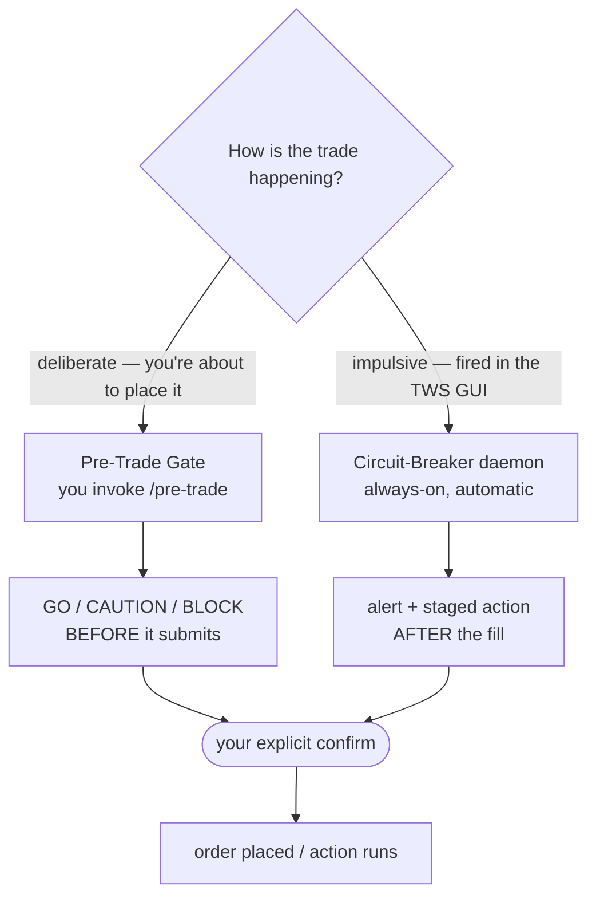
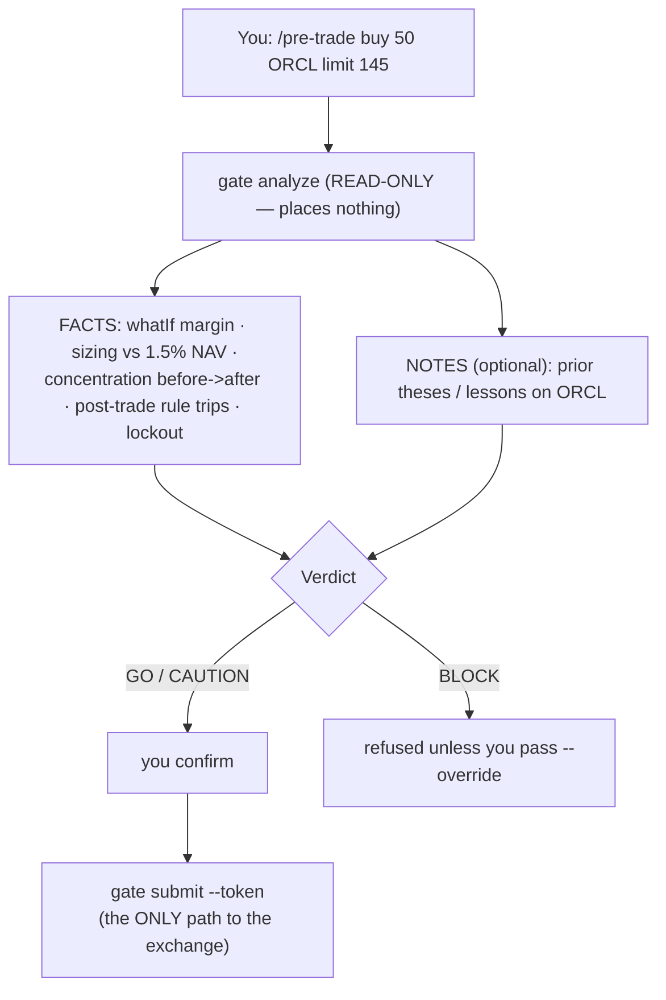
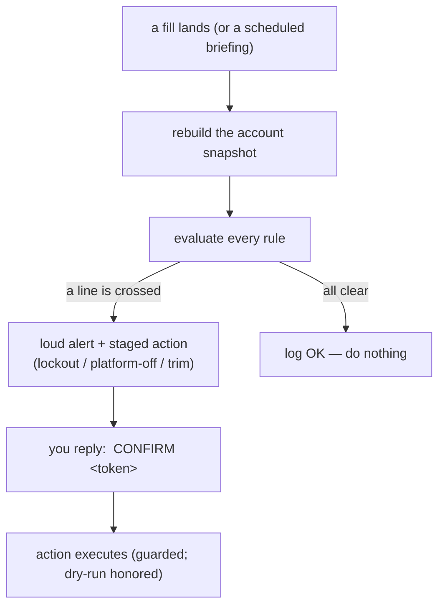
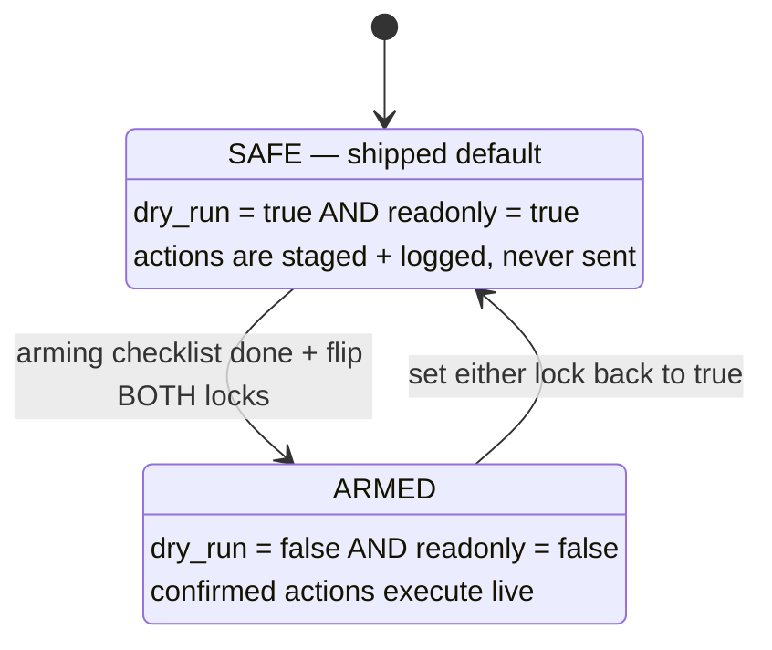

# ib-governor — Operator's Handbook

> How to *drive* ib-governor day to day. (For the quick reference see [Home](index.md); for how/why it's built, see [FORCLAUDE](FORCLAUDE.md).)

## Contents
- [1. What it is - and which half to reach for](#1-what-it-is-and-which-half-to-reach-for)
- [2. What it supports today](#2-what-it-supports-today)
- [3. One-time setup](#3-one-time-setup)
- [4. Daily use - the pre-trade gate](#4-daily-use-the-pre-trade-gate)
- [5. Daily use - the circuit-breaker](#5-daily-use-the-circuit-breaker)
- [6. Reading a verdict](#6-reading-a-verdict)
- [6b. The setup read (📈 SETUP panel)](#6b-the-setup-read--setup-panel)
- [7. The rules (what trips it)](#7-the-rules-what-trips-it)
- [8. Going live (arming)](#8-going-live-arming)
- [9. Troubleshooting](#9-troubleshooting)
- [10. Command cheat-sheet](#10-command-cheat-sheet)

---

## 1. What it is - and which half to reach for

ib-governor is **two machines** that catch the two different ways trading discipline breaks. You don't pick between them by preference — you use the one that matches *how the trade is happening*.



- **Pre-trade gate** — *proactive.* When you mean to place a trade, run it through the gate first. It analyzes the trade and won't submit until you confirm. **This is your everyday tool.**
- **Circuit-breaker** — *reactive.* A background daemon watching your account. It can't stop a GUI click, but it catches the *pattern* (house-money churn, overtrading, oversized overnight…) and brakes the *next* batch.

**The iron rule for both: nothing ever touches your account without your explicit tap.**

---

## 2. What it supports today

| Area | Supported | Notes |
|------|-----------|-------|
| **Pre-trade gate** | Equities + Futures | stocks and futures roots (MNQ, ES, NQ, MES, CL…) |
| **Order types** | market · limit · stop · stop-limit | structured `--type` + `--limit`/`--stop` |
| **Breaker — futures** | house-money lockout, daily-loss stop, overtrading, overnight notional, live notional, same-contract churn | |
| **Breaker — equities** | single-name + sector concentration, re-trade churn, add-into-drawdown | |
| **Breaker — portfolio** | margin cushion, gross leverage, drawdown moratorium | cross-asset |
| **Alerts / confirms** | Telegram (two-way) + macOS | reply `CONFIRM <token>` to act |
| **Notes grounding** *(optional)* | reads a research-notes folder (`$VAULT_DIR`) at the gate | per-name theses, lessons, the rule card — skip it and the gate still runs on the numbers |

**What it deliberately does *not* do:**
- ❌ Auto-execute anything — every action waits for your confirm.
- ❌ Pre-screen impulsive GUI clicks (IBKR exposes no pre-flight hook — that's what the breaker backstops).
- ❌ Options (descoped — futures/equities/portfolio only).
- ❌ Tell you *what* to buy. It's a brake, not a stock-picker.

---

## 3. One-time setup

```bash
python -m venv .venv && .venv/bin/pip install -e ".[dev]"   # deps
cp .env.example .env                                         # add Telegram token + chat id (see its comments)
# edit config/rules.yaml if you want to tune thresholds (optional — ships with sensible defaults)
```

Point `$GOVERNOR_HOME` at your checkout (default `~/ib-governor`), then install the skills so `/pre-trade` is invocable (run once, then restart Claude Code):
```bash
export GOVERNOR_HOME="$HOME/ib-governor"
for s in pre-trade pre-trade-equities pre-trade-futures; do
  ln -s "$GOVERNOR_HOME/skills/$s" "$HOME/.claude/skills/$s"
done
```

**You start SAFE.** Out of the box `dry_run: true` and `readonly: true` — ib-governor analyzes and *stages* but never sends an order. See [§8](#8-going-live-arming) to arm it.

---

## 4. Daily use - the pre-trade gate

**When:** any time you're about to deliberately place a trade. **How:** just tell the `/pre-trade` skill in plain language — it routes to the equities or futures analyst by symbol.



**Worked example** — what you'd see:

```text
You: /pre-trade buy 50 ORCL limit 145

  ORCL   BUY 50 @ limit 145.00   (STK)
  whatIf:        initial margin +$3,625 · buying power OK
  sizing:        $7,250 = 2.0% of NAV     ⚠ over the 1.5% band
  concentration: ORCL 4% -> 6% of NAV     (15% cap — ok)
  rules:         none tripped on the post-trade book
  notes:         2 notes — "ORCL thesis (Q2)", "don't chase > 145"

  VERDICT: CAUTION  — size is over the 1.5% band, and your notes say don't chase > 145.
  Want to size down, or confirm anyway?
```

You then either adjust (e.g. "make it 30 shares") or confirm. On confirm, the skill runs `submit --token` and reports whether it placed live or held it in DRY-RUN.

**Order types:**
| You want | Say | Becomes |
|----------|-----|---------|
| Market | `buy 50 ORCL` | `--type market` |
| Limit | `buy 50 ORCL limit 145` | `--type limit --limit 145` |
| Stop | `sell 50 ORCL stop 138` | `--type stop --stop 138` |
| Stop-limit | `sell 50 ORCL stop 138 limit 137` | `--type stop-limit --stop 138 --limit 137` |

Futures are the same with a root symbol: `/pre-trade short 2 MNQ` ("short" = sell).

> Under the hood the skill calls `python -m governor.gate analyze … --json`; you can run that directly too (see the [cheat-sheet](#10-command-cheat-sheet)).

---

## 5. Daily use - the circuit-breaker

**When:** runs in the background during market hours (keep it alive with `launchd`). It re-checks your account the instant a fill lands, and sends 3 proactive briefings a day.

```bash
PYTHONPATH=src .venv/bin/python -m governor.live.daemon
```



**Responding to an alert:** you'll get a Telegram + macOS message like *"🛑 futures.house_money_lockout [hard] — realized +$3,400 today…"* followed by a staged action with a token. Reply `CONFIRM 4F2A9C1B` within ~5 minutes to run it. Ignore it and nothing happens. Tokens are single-use and expire.

**The 3 briefings** (default 10:30 / 12:30 / 15:55 ET) push a state summary even when nothing's wrong — so you always know where you stand.

### Keep it running (launchd)

Rather than manually starting the daemon each session, register it as a launchd agent so macOS keeps it alive automatically. The agent ships as a **template** (`launchd/com.ib-governor.daemon.plist.template`) because launchd needs absolute paths and won't expand `$VARS` or `~` — so you `sed`-replace the `__GOVERNOR_HOME__` placeholders with your absolute checkout path on the way in:

```bash
mkdir -p logs
sed "s#__GOVERNOR_HOME__#$GOVERNOR_HOME#g" \
  launchd/com.ib-governor.daemon.plist.template \
  > ~/Library/LaunchAgents/com.ib-governor.daemon.plist
launchctl load ~/Library/LaunchAgents/com.ib-governor.daemon.plist   # unload to stop
```

What you get:
- **Auto-start** at login and after crashes (`KeepAlive: SuccessfulExit = false` restarts it on any non-zero exit).
- **Telegram works** because the daemon calls `load_env_file()` on startup, which reads your `.env` before `telegram_from_env()` runs — launchd doesn't source your shell profile, so without this Telegram creds would be empty and alerts would go dark.
- **Logs** land in `logs/governor.out.log` and `logs/governor.err.log` (the `logs/` directory is git-ignored).

To stop it: `launchctl unload ~/Library/LaunchAgents/com.ib-governor.daemon.plist`.

> **Robustness:** the template sets `ThrottleInterval: 30` — if TWS isn't up yet (e.g. right after login) the daemon exits and launchd respawns it calmly every 30s instead of hot-looping. Mid-session disconnects self-heal via the daemon's own reconnect backoff (5→60s).

### Schedule the daily summary (launchd)

Run the **`daily-summary`** skill unattended every weekday, so a "Market Close" note + Telegram recap land without you lifting a finger. It ships as a template too (`launchd/com.ib-governor.daily-summary.plist.template`). It runs `claude -p /daily-summary` headless, so it needs the `claude` CLI on PATH, the skill installed (symlinked into `~/.claude/skills`), and an explicit env (launchd ignores your shell profile):

```bash
CLAUDE_BIN="$(command -v claude)"
sed -e "s#__GOVERNOR_HOME__#$GOVERNOR_HOME#g" \
    -e "s#__VAULT_DIR__#$VAULT_DIR#g" \
    -e "s#__HOME__#$HOME#g" \
    -e "s#__CLAUDE_BIN__#$CLAUDE_BIN#g" \
  launchd/com.ib-governor.daily-summary.plist.template \
  > ~/Library/LaunchAgents/com.ib-governor.daily-summary.plist
launchctl load  ~/Library/LaunchAgents/com.ib-governor.daily-summary.plist
launchctl start com.ib-governor.daily-summary   # optional: fire once now to test
```

What you get / need to know:
- **Fires weekdays** at the `StartCalendarInterval` time (ships 14:30 local — set it to ~90 min after *your* market close so fills + final marks settle).
- **Read-only.** It pulls data, writes a vault note (`$VAULT_DIR/invest/daily-recaps/<date> Market Close.md`), and sends Telegram — it never places an order.
- **Collision-free.** The collector connects on its own `daily_client_id` (6), distinct from the daemon (4) and the pre-trade gate (5), so it reads while the daemon holds its connection.
- **TWS must be up** at that time; if it's down the run says so and writes nothing (fails loud — never fabricates).
- **Logs:** `logs/daily-summary.{out,err}.log`. To stop: `launchctl unload ~/Library/LaunchAgents/com.ib-governor.daily-summary.plist`.

---

## 6. Reading a verdict

Both halves speak the same language. **The verdict only ever escalates toward caution — it never downgrades a hard stop.**

| Verdict | Means | Your move |
|---------|-------|-----------|
| 🟢 **GO** | Clean on the numbers *and* consistent with your notes (if any). | Confirm if you still want it. (It still needs your tap.) |
| 🟡 **CAUTION** | A soft line: size over 1.5% NAV, concentration climbing, a WARN rule, or a relevant past mistake in your notes. | Read the reason. Size down, or confirm deliberately. |
| 🔴 **BLOCK** | A hard line: an active lockout, a HARD rule would trip, or insufficient margin. | Don't. If you truly must, the gate requires an explicit `--override`. |

---

## 6b. The setup read (📈 SETUP panel)

The pre-trade gate automatically fetches daily bars for the symbol and renders a setup-quality panel — 📈 SETUP — alongside the risk panel. This costs one `reqHistoricalData` call on the gate's already-open socket and is fail-soft: if bars aren't available, the panel is absent and the verdict is unaffected.

**What the panel shows:**

*Equities:*
- **Stage 2 X/7** — Minervini's 7-criterion checklist: price above MA50 / MA150 / MA200, MA stack (50>150>200), MA200 slope rising, 52-week position ≥75%, and range ratio ≥1.3×. Classified as `confirmed` (6–7/7), `candidate` (4–5), or `none` (≤3).
- **VCP pivot / distance** — the most recent contraction's pivot level, how far price is from it (five bands: `pre_breakout` = price still below the pivot; `actionable` = ≤5% above; `extended` = 5–10% above; `wait` = 10–15% above, let it come back; `too_late` = >15% above), the last contraction grade, and a volume dry-up flag. The boolean `extended` flag (>5% past pivot) is the gate trigger for CAUTION; `distance_band` is the finer-grained descriptive bucket.

*Futures:*
- **Trend alignment** — price vs the 20/50/200-day MAs on the continuous contract. With-trend ✅, mixed 🟡, counter-trend 🔴.
- **Vol regime** — ATR percentile over the prior 100 bars. Elevated (>70th pctile) means stops may need widening; 🟡 when elevated.
- **Location / extension** — distance from the 20-day high/low. At the range extreme (chasing): 🔴.
- **Momentum** — RSI(14). Overbought on a long or oversold on a short: 🟡.

A poor setup (Stage 2 not confirmed, extended past pivot, counter-trend, chasing, or elevated vol) escalates the verdict to **CAUTION**. It never blocks — only a hard rule or an active lockout can produce a BLOCK.

VCP and Stage-2 are stock-only. For futures, the gate always runs the four-factor read.

**Tuning the setup read via `setup:` in `config/rules.yaml`:**

> Note: the local `config/rules.yaml` is armed and skip-worktree. Edit your local copy directly; do not commit it.

| Key | Default | What it does |
|-----|---------|--------------|
| `setup.history_duration` | `"1 Y"` | Duration string passed to `reqHistoricalData` (~252 daily bars) |
| `setup.min_bars` | `200` | Fewer bars than this → setup marked `available: False` |
| `setup.equities.stage2_confirmed_min` | `6` | Minimum criteria count (of 7) to classify as `confirmed` |
| `setup.equities.pivot_extended_pct` | `0.05` | Distance past pivot (5%) → `extended` → CAUTION |
| `setup.equities.pivot_too_late_pct` | `0.15` | Distance past pivot (15%) → `too_late` |
| `setup.equities.contraction_loose_pct` | `0.18` | Last contraction retracement > 18% → `too_loose` |
| `setup.futures.atr_elevated_pctile` | `0.70` | ATR above this percentile → "elevated" vol → CAUTION |
| `setup.futures.extension_chase_pct` | `0.02` | Within 2% of 20d high/low → "chasing" → CAUTION |
| `setup.futures.range_lookback` | `20` | Bars to compute the recent high/low for the location factor |
| `setup.futures.atr_lookback` | `100` | Bars window for the ATR percentile calculation |

**Two known caveats — documented so they're not surprises:**

1. **Flat-vol → "elevated" (futures):** The ATR percentile is computed by counting how many of the prior 100 bars have an ATR ≤ the current bar's ATR. In a dead-flat regime where every bar has the same range, the current bar ties or beats every prior bar — the percentile reads 1.0 (100th) and the panel shows 🟡 "elevated vol," even though there's no actual expansion. This is fail-safe behavior (CAUTION, never BLOCK). If it's noisy on a low-vol instrument, raise `setup.futures.atr_elevated_pctile` (e.g. to `0.80`).

2. **MA200-rising needs ~221 bars:** The "MA200 slope rising" Stage-2 criterion calculates a 200-bar moving average and then checks whether the MA itself has risen over a 20-bar lookback window — so it needs 200 bars for the MA *plus* 20 more to compare the slope endpoints. With the default `history_duration: "1 Y"` (~252 bars) this is comfortably met. For a name with only 200–220 bars of history, the slope criterion will evaluate to `False` even if the trend is clearly up, capping the Stage-2 score at 6/7. Production-moot with the default duration, documented here for the curious.

---

## 7. The rules (what trips it)

The full, always-current list is in **[docs/RULES.md](RULES.md)** (generated from code — it can't drift). Quick view:

- **Futures:** house-money lockout · daily-loss stop · overtrading (warn→halt) · overnight notional · live notional · same-contract churn
- **Equities:** single-name >15% · sector >25% · re-trade >2×/week · add-into-drawdown
- **Portfolio:** margin cushion · gross leverage · drawdown moratorium

**Tuning:** every threshold lives in `config/rules.yaml` and is yours to change (validated on load). Want to know which key controls a rule? The **Config keys** column in [RULES.md](RULES.md) maps each one.

---

## 8. Going live (arming)

You ship SAFE and stay there until you deliberately flip *two* locks.



**Why two locks?** `dry_run` is the app gate; `readonly` is the IBKR connection itself refusing writes. Both must be off to place live — defense in depth. (The gate warns you if you set `dry_run: false` but leave `readonly: true`, since orders would be silently rejected.)

**Before flipping** (full list in [SECURITY.md](SECURITY.md)) — the code is ready; what's left is operational:
1. Run the daemon once and watch a real alert → `CONFIRM` → "DRY-RUN would execute…" loop.
2. Turn off TWS's "Read-Only API" setting, set `live.readonly: false`, then `live.dry_run: false`.

Everything else (Telegram, trim idempotency, MNQ-notional accuracy) is already handled in code.

---

## 9. Troubleshooting

| Symptom | What it means | Do |
|---------|---------------|-----|
| Gate says "could not connect to TWS" | TWS/Gateway isn't up or the API is off | Start TWS, enable the API on port 7496 |
| "🛑 BRAKE BLIND" alert | The daemon lost data or can't read state | It's failing *safe* — check TWS/connection; it never assumes all-clear |
| "token invalid / expired" on submit | The ~5-min staged token lapsed or was used | Re-run the analysis to stage a fresh one |
| A trade you want is BLOCKED | A hard line genuinely trips | Re-check the reason; if deliberate, `analyze … --override` then submit |
| `/pre-trade` not found | Skills not installed / Claude Code not restarted | Run the install in [§3](#3-one-time-setup), restart |
| "armed but readonly" warning on submit | `dry_run` is off but `readonly` is on | Set `live.readonly: false` (the second lock) |
| **Disarm / roll back fast** (stop all live action) | You're armed and want to revert to safe | **Stop the daemon** (fastest), and/or set `live.dry_run: true` (or `readonly: true`) and restart it. `git checkout config/rules.yaml` restores the shipped-safe defaults. |

---

## 10. Command cheat-sheet

```bash
# Analyze a trade (read-only; stages a confirm token). Prefer the /pre-trade skill, but direct:
PYTHONPATH=src .venv/bin/python -m governor.gate analyze buy 50 ORCL --type limit --limit 145 --json
PYTHONPATH=src .venv/bin/python -m governor.gate analyze short 2 MNQ --sec-type fut --json

# Submit a staged order (the only write path; needs the token from analyze + dry_run honored)
PYTHONPATH=src .venv/bin/python -m governor.gate submit --token 4F2A9C1B

# Run the always-on circuit-breaker daemon
PYTHONPATH=src .venv/bin/python -m governor.live.daemon

# See / regenerate the rule catalog
PYTHONPATH=src .venv/bin/python -m governor.rules.catalog   # writes docs/RULES.md

# Tests
.venv/bin/python -m pytest -q
```

In Telegram, the only thing you ever send back is: **`CONFIRM <token>`**.
